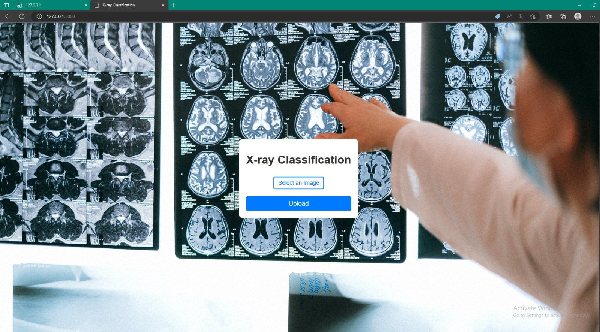

# COVID-19 Chest X-ray Classification

## Overview

The global impact of the coronavirus pandemic has led to the exploration of advanced technologies for rapid and accurate screening of COVID-19 infections. X-ray imaging has emerged as a valuable diagnostic tool, but distinguishing COVID-19 cases from other viral pneumonias remains challenging.

This project investigates the utility of artificial intelligence (AI) in detecting COVID-19 from chest X-ray images. The dataset comprises 21,165 samples categorized into four main classes: COVID-19, Lung Opacity, Normal, and Viral Pneumonia. The dataset's current distribution includes 3,616 COVID-19 cases, 10,192 Normal cases, 6,012 Lung Opacity cases, and 1,345 Viral Pneumonia cases.

### Acknowledgments

We express gratitude to the institutions and researchers who contributed to the data collection.

### Key Objectives

- 80% of the dataset consists of Healthy and Lung Opacity samples.
- Primary focus on recognizing COVID-19 patients.
- Exploration of model challenges in identifying Pneumonia or COVID samples.
- Emphasis on metrics like Precision, Recall, and F1-Score due to dataset imbalance.

## Exploration Insights

### Dataset Overview

- The dataset contains a substantial number of images.
- No data cleansing is required.
- Exploratory Data Analysis (EDA) conducted on metadata.
- Unbalanced dataset with nearly 50% of samples belonging to the "Healthy" class.

### Image Data EDA

- Patterns and relationships between images and classes explored.
- Scatter plot analysis of mean and standard deviation.
- Visualizations by class to understand image distribution.
- Brightness and contrast characteristics revealed through visualizations.

## Convolutional Neural Network (CNN) Model

### Model Architecture

- Utilizes ImageDataGenerator for Data Augmentation.
- Organizes files into training and validation sets.
- Incorporates different settings for train and test_datagen.
- Employs a simple CNN architecture.
- Analysis includes Confusion Matrix, Accuracy, Precision, Recall, and F-Score.
  ### Model Summary
The architecture consists of convolutional layers followed by max-pooling layers for feature extraction. The final layers include flattening, dense layers, and a softmax output layer for classification.
- Input Shape: (299, 299, 3) - Represents image dimensions with three color channels (RGB).
- Convolutional Layers: 4 layers with increasing filter depth for feature extraction.
- MaxPooling Layers: 4 layers to reduce spatial dimensions and retain important features.
- Flatten Layer: Flattens the output for input to dense layers.
- Dense Layers: 2 dense layers with ReLU activation.
- Output Layer: Dense layer with softmax activation for multi-class classification.
### Training and Validation Results

- Training and validation lines closely follow each other, indicating good generalization.
- Promising results achieved with a simple architecture.
- High overall accuracy observed with no significant overfitting.

## Achievements

- COVID class shows ~93% Precision and ~90% Recall.
- Normal and Viral Pneumonia classes exhibit higher Recall than Precision.
- F-Score balances Precision and Recall, highlighting areas for improvement.
- Overall metrics are above 85%, with a focus on reducing misclassifications.

This project serves as a valuable exploration into leveraging AI for COVID-19 detection from chest X-ray images.

## Model Deployment
The model is deployed using Flask for web application development.
### Input

### Deployment Instructions
Clone the repository.
Run the Flask application locally for firsthand experience.

### Contribution Guidelines

Feel free to explore, contribute, and improve the capabilities of this project for the greater good.
